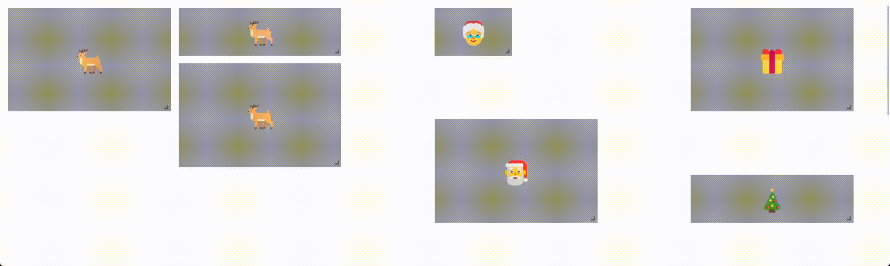

# svelte-grid-extended 🍾

[](https://badge.fury.io/js/svelte-grid-extended)

<!-- image at .github/images/santa.gif -->


## Description

Svelte-Grid-Extended is a draggable, resizable ~~and responsive~~ grid layout. The package is created as extended verison of [svelte-grid](https://github.com/vaheqelyan/svelte-grid).

## Installation

With NPM:

```sh
npm install svelte-grid-extended
```

With Yarn:

```shPackage currently in alpha, please consider that it **will** be changed in the future
yarn add svelte-grid-extended
```

With pnpm:

```sh
pnpm add svelte-grid-extended
```

### Table of Contents

- [Description](#description)
- [Installation](#installation)
- [Table of Contents](#table-of-contents)
- [Usage](#usage)
- [Basic](#basic)
- [Static grid](#static-grid)
- [Grid without bounds](#grid-without-bounds)
- [Styling](#styling)
- [Disable interactions](#disable-interactions)
- [Collision Behavior](#collision-behavior)
  - [None](#none)
  - [Push](#push)
  - [Compress](#compress)
- [Custom move/resize handle](#custom-moveresize-handle)
- [Two way binding](#two-way-binding)
- [API Documentation](#api-documentation)
- [Grid props](#grid-props)
- [GridItem props](#griditem-props)
- [Style related props:](#style-related-props)
- [Events](#events)
- [Grid Controller](#grid-controller)
- [Methods](#methods)
  - [getFirstAvailablePosition(w, h)](#getfirstavailablepositionw-h)
  - [Example](#example)
- [📜 License](#-license)

## Usage

### Basic

✨ [repl](https://svelte.dev/repl/effd88614c0c4372864ebeb582415a21?version=4.1.1)

```svelte
<script lang="ts">
	import Grid, { GridItem } from 'svelte-grid-extended';
</script>

<Grid cols={10} rows={10}>
	<GridItem x={1} y={0} class="item">Hey</GridItem>
	<GridItem x={3} y={3} w={4} class="item">Hoy</GridItem>
</Grid>
```

### Static grid

When `cols` or `rows` and `itemsSize` are set, grid becomes static and ignores the size of the container.

It can be set to both dimensions or just one.

Both:
✨ [repl](https://svelte.dev/repl/7d431c0884d343529e5e98fcbe74afbd?version=4.1.1)

```svelte
<script lang="ts">
	import Grid, { GridItem } from 'svelte-grid-extended';

	const itemSize = { width: 100, height: 40 };
</script>

<Grid {itemSize} cols={10} rows={10}>
	<GridItem x={1} y={0} class="item">Hey</GridItem>
	<GridItem x={3} y={3} w={4} class="item">Hoy</GridItem>
</Grid>
```

Only rows:
✨ [repl](https://svelte.dev/repl/53994707c9f84d2cad2f9eac5a9f9ea6?version=4.1.1)

```svelte
<script lang="ts">
	import Grid, { GridItem } from 'svelte-grid-extended';

	const itemSize = { height: 40 };
</script>

<Grid {itemSize} cols={10} rows={10}>
	<GridItem x={1} y={0} class="item">Hey</GridItem>
	<GridItem x={3} y={3} w={4} class="item">Hoy</GridItem>
</Grid>
```

### Grid without bounds

When `cols` or/and `rows` set to 0, grid grows infinitly. The grid container adapts its width and height to fit all elements.

It can be set to both dimensions or just one.

✨ [repl](https://svelte.dev/repl/ade95bbc3a7445518df6a51c3fd9be2e?version=4.1.1)

```svelte
<script lang="ts">
	import Grid, { GridItem } from 'svelte-grid-extended';

	const itemSize = { width: 100, height: 40 };
</script>

<Grid {itemSize} cols={0} rows={0}>
	<GridItem x={1} y={0} class="item">Hey</GridItem>
	<GridItem x={3} y={3} w={4} class="item">Hoy</GridItem>
</Grid>
```

### Styling

Grid can be styled with classes passed to various props. Check [Style related props](#style-related-props) section for more info.

✨ [repl](https://svelte.dev/repl/97243bc1472d42ff944e47c30b72d73d?version=4.1.1)

```svelte
<script lang="ts">
	import Grid, { GridItem } from 'svelte-grid-extended';
</script>

<Grid class="grid-container" cols={10} rows={10}>
	<GridItem
		x={0}
		y={0}
		class="grid-item"
		activeClass="grid-item-active"
		previewClass="bg-green-500 rounded"
		resizerClass=""
	>
		<div class="item">{item.id}</div>
	</GridItem>
</Grid>

<style>
	:global(.grid-container) {
		opacity: 0.7;
	}

	:global(.grid-item) {
		transition:
			width 4s,
			height 4s;
		transition:
			transform 4s,
			opacity 4s;
	}

	:global(.grid-item-active) {
		opacity: 0.1;
	}

	/* tailwind classes */
	:global(.bg-red-500) {
		background-color: rgb(202, 33, 33);
	}

	:global(.rounded) {
		border-radius: 0.25rem;
	}
</style>
```

### Disable interactions

To disable interactions, set `readOnly` prop to `true`. Or set `movable` and/or `resizable` to `false` on specific item.

Read Only grid: ✨ [repl](https://svelte.dev/repl/e7183ff3136c47fe94fcd5398573aef5?version=4.1.1)

```svelte
<script lang="ts">
	import Grid, { GridItem } from 'svelte-grid-extended';
</script>

<Grid cols={10} rows={10} readOnly>
	<GridItem x={1} y={0} class="item">Hey</GridItem>
	<GridItem x={3} y={3} w={4} class="item">Hoy</GridItem>
</Grid>
```

Make item non-interactive: ✨ [repl](https://svelte.dev/repl/50f1acb8be5b426896cb6d9b6c10e9f8?version=4.1.1)

```svelte
<script lang="ts">
	import Grid, { GridItem } from 'svelte-grid-extended';
</script>

<Grid cols={10} rows={10}>
	<GridItem x={1} y={0} class="item" movable={false}>Hey</GridItem>
	<GridItem x={3} y={3} w={4} class="item" resizable={false}>Hoy</GridItem>
</Grid>
```

### Collision Behavior

The `collision` prop controls how the grid handles collisions. There are three available options: `none`, `push`, and `compress`.

#### None

Setting `collision` prop to `none` will ignore any collisions. This is the default behavior.

✨ [repl](https://svelte.dev/repl/c549a05c30b84793b2bab156f49bedd3?version=4.1.1)

```svelte
<script lang="ts">
	import Grid, { GridItem } from 'svelte-grid-extended';

	const items = [
		{ id: '0', x: 0, y: 0, w: 2, h: 5 },
		{ id: '1', x: 2, y: 2, w: 2, h: 2 },
		{ id: '2', x: 2, y: 0, w: 1, h: 2 },
		{ id: '3', x: 3, y: 0, w: 2, h: 2 },
		{ id: '4', x: 4, y: 2, w: 1, h: 3 },
		{ id: '5', x: 8, y: 0, w: 2, h: 8 }
	];

	const itemSize = { height: 40 };
</script>

<Grid {itemSize} cols={10} collision="none">
	{#each items as item}
		<GridItem x={item.x} y={item.y} w={item.w} h={item.h}>
			<div class="item">{item.id}</div>
		</GridItem>
	{/each}
</Grid>
```

#### Push

Setting `collision` prop to `push` will cause grid items to move to the first available space when colliding. The grid will grow vertically as needed to accommodate all items.

✨ [repl](https://svelte.dev/repl/36abb5e5be6f4b0ebe637b2676ccf606?version=4.1.1)

```svelte
<script lang="ts">
	import Grid, { GridItem } from 'svelte-grid-extended';

	const items = [
		{ id: '0', x: 0, y: 0, w: 2, h: 5 },
		{ id: '1', x: 2, y: 2, w: 2, h: 2 },
		{ id: '2', x: 2, y: 0, w: 1, h: 2 },
		{ id: '3', x: 3, y: 0, w: 2, h: 2 },
		{ id: '4', x: 4, y: 2, w: 1, h: 3 },
		{ id: '5', x: 8, y: 0, w: 2, h: 8 }
	];

	const itemSize = { height: 40 };
</script>

<Grid {itemSize} cols={10} collision="push">
	{#each items as item}
		<GridItem x={item.x} y={item.y} w={item.w} h={item.h}>
			<div class="item">{item.id}</div>
		</GridItem>
	{/each}
</Grid>
```

#### Compress

Setting `collision` prop to `compress` will compress items vertically towards the top into any available space when colliding. The grid will grow vertically as needed to accommodate all items.

✨ [repl](https://svelte.dev/repl/86cff54f2efa437285c3245ecb713702?version=4.1.1)

```svelte
<script lang="ts">
	import Grid, { GridItem } from 'svelte-grid-extended';

	const items = [
		{ id: '0', x: 0, y: 0, w: 2, h: 5 },
		{ id: '1', x: 2, y: 2, w: 2, h: 2 },
		{ id: '2', x: 2, y: 0, w: 1, h: 2 },
		{ id: '3', x: 3, y: 0, w: 2, h: 2 },
		{ id: '4', x: 4, y: 2, w: 1, h: 3 },
		{ id: '5', x: 8, y: 0, w: 2, h: 8 }
	];

	const itemSize = { height: 40 };
</script>

<Grid {itemSize} cols={10} collision="compress">
	{#each items as item}
		<GridItem x={item.x} y={item.y} w={item.w} h={item.h}>
			<div class="item">{item.id}</div>
		</GridItem>
	{/each}
</Grid>
```

> ⚠️ Setting `collision` to `push` or `compress` will set `rows` to `0` so `ItemSize.height` must be setted.

### Custom move/resize handle

✨ [repl](https://svelte.dev/repl/5f9dbbd845cc40f6a222734856fc9b1d?version=4.1.1)

```svelte
<script lang="ts">
	import Grid, { GridItem } from 'svelte-grid-extended';
</script>

<Grid cols={10} rows={10}>
	<GridItem x={0} y={0}>
		<div slot="moveHandle" let:moveStart>
			<div on:pointerdown={moveStart}>MOVE</div>
		</div>

		<div slot="resizeHandle" let:resizeStart>
			<div on:pointerdown={resizeStart}>Resize</div>
		</div>

		<!-- content -->
	</GridItem>
</Grid>
```

### Two way binding

✨ [repl](https://svelte.dev/repl/ef5d5716505642b7a9212c3d0c7b6803?version=4.1.1)

```svelte
<script lang="ts">
	import Grid, { GridItem } from 'svelte-grid-extended';

	let items = [
		{ x: 6, y: 0, w: 2, h: 2, data: { text: '🎅' } },
		{ x: 6, y: 2, w: 2, h: 2, data: { text: '🤶' } }
	];

	const itemsBackup = structuredClone(items);

	function resetGrid() {
		items = structuredClone(itemsBackup);
	}
</script>

<button on:click={resetGrid}> RESET </button>

<Grid cols={10} {itemSize}>
	{#each items as item}
		<GridItem bind:x={item.x} bind:y={item.y} bind:w={item.w} bind:h={item.h}>
			{item.data.text}
		</GridItem>
	{/each}
</Grid>
```

## API Documentation

### Grid props

| prop         | description                                                                                                            | type                                | default |
| ------------ | ---------------------------------------------------------------------------------------------------------------------- | ----------------------------------- | ------- |
| cols         | Grid columns count. If set to 0, grid will grow infinitly. Must be >= 0.                                               | number                              | 0       |
| rows         | Grid rows count. If set to 0, grid will grow infinitly. Must be >= 0.                                                  | number                              | 0       |
| itemSize     | Size of the grid item. If not set, grid will calculate it based on container size.                                     | { width?: number, height?: number } | {}      |
| gap          | Gap between grid items.                                                                                                | number                              | 10      |
| bounds       | Should grid items be bounded by the grid container.                                                                    | boolean                             | false   |
| readonly     | If true disables interaction with grid items.                                                                          | boolean                             | false   |
| collision    | Collision behavior of grid items. [About](#collision-behavior)                                                         | none \| push \| compress            | none    |
| autoCompress | Auto compress the grid items when programmatically changing grid items. Only works with 'compress' collision strategy. | boolean                             | true    |

> ⚠️ if `cols` or/and `rows` are set to 0, `itemSize.width` or/and `itemSize.height` must be setted.

> ⚠️ Setting `collision` to `push` or `compress` will set `rows` to `0` so `ItemSize.height` must be setted.

### GridItem props

| prop      | description                                                                                        | type                                  | default        |
| --------- | -------------------------------------------------------------------------------------------------- | ------------------------------------- | -------------- |
| id        | Unique id of the item. Used to compare items during collision tests                                | string                                | uuid.v4        |
| x         | X position of the item in grid units.                                                              | number                                | required       |
| y         | Y position of the item in grid units.                                                              | number                                | required       |
| w         | Width of the item in grid units.                                                                   | number                                | 1              |
| h         | Height of the item in grid units.                                                                  | number                                | 1              |
| min       | Minimum size of the item in Grid Units.                                                            | { w: number, h: number }              | { w: 1, h: 1 } |
| max       | Maximum size of the item in Grid Units. If not provided, the item will be able to grow infinitely. | { w: number, h: number } \| undefined | undefined      |
| movable   | If true, item can be moved by user.                                                                | boolean                               | true           |
| resizable | If true, item can be resized by user.                                                              | boolean                               | true           |

### Style related props:

Component can be styled with css framework of your choice or with global classes. To do so, you can use the following props:

- `<Grid class="..." />` - class name for grid container.
- `<GridItem class="..." />` - class name for grid item.
- `<GridItem activeClass="..." />` - class name that applies when item is currently being dragged or resized. By default, it is used to make active grid item transparent.
- `<GridItem previewClass="..." />` - class name for preview where item will be placed after interaction.
- `<GridItem resizerClass="..." />` - class name for item's resize handle.

To understand how to use these props, look at `<Grid />` component simplified structure.

> 📄 `active` is variable that indicates if grid item is currently being dragged or resized:

```svelte
<!-- Grid -->
<div class={class}>
	<!-- GridItem -->
	<div class={itemClass} class:activeClass={active}>
		<slot />
		<!-- Resizer -->
		<div class={resizerClass} />
		<!-- Resizer -->
	</div>

	{#if active}
		<!-- GridItemGhost -->
		<div class={previewClass} />
	{/if}

	<!-- /GridItem -->
</div>
<!-- /Grid -->
```

## Events

Grid emits the following events:

| event name | description                          | payload            |
| ---------- | ------------------------------------ | ------------------ |
| change     | Emitted when grid items are changed. | {item: LayoutItem} |

```svelte
<script lang="ts">
	import Grid, { GridItem, type LayoutChangeDetail } from 'svelte-grid-extended';

	function logItem(event: CustomEvent<LayoutChangeDetail>) {
		console.log(event.detail.item);
	}
</script>

<Grid cols={10} rows={10} on:change={logItem}>
	<GridItem x={1} y={0} class="item" on:change={logItem}>Hey</GridItem>
	<GridItem x={3} y={3} w={4} class="item" on:previewchange={logItem}>Hoy</GridItem>
</Grid>
```

## Grid Controller

The Grid Controller provides utility functions that allow for more advanced control and customization of the grid. It's obtained from the Grid component using the `bind:controller` attribute, offering a way to interact with the grid in a programmatic and flexible manner.

### Methods

#### getFirstAvailablePosition(w, h)

Finds the first available position within the grid that can accommodate an item of the specified width (w) and height (h). This method is useful when dynamically adding new items to the grid, ensuring that they fit into the first available space that can hold them.

**Parameters:**

- `w` (number): Width of the item.
- `h` (number): Height of the item.

**Returns:**

- An object containing the `x` and `y` coordinates of the first available position, or `null` if no position is available.

##### Example

✨ [repl](https://svelte.dev/repl/6af014e1f754458dbc15c1823dbdca3c?version=4.1.2)

```svelte
<script lang="ts">
	import Grid, { GridItem, type GridController } from 'svelte-grid-extended';

	let items = [
		{ id: '1', x: 0, y: 0, w: 2, h: 5 },
		{ id: '2', x: 2, y: 2, w: 2, h: 2 }
	];

	let gridController: GridController;

	function addNewItem() {
		const w = Math.floor(Math.random() * 2) + 1;
		const h = Math.floor(Math.random() * 5) + 1;
		const newPosition = gridController.getFirstAvailablePosition(w, h);
		items = newPosition
			? [...items, { id: crypto.randomUUID(), x: newPosition.x, y: newPosition.y, w, h }]
			: items;
	}

	const itemSize = { height: 40 };
</script>

<button on:click={addNewItem}>Add New Item</button>

<Grid {itemSize} cols={10} collision="push" bind:controller={gridController}>
	{#each items as { id, x, y, w, h } (id)}
		<div transition:fade={{ duration: 300 }}>
			<GridItem {id} bind:x bind:y bind:w bind:h>
				<div>{id}</div>
			</GridItem>
		</div>
	{/each}
</Grid>
```

#### compress()

Compresses all items vertically towards the top into any available space.

##### Example

✨ [repl](https://svelte.dev/repl/79bcc70f11944d9e9b03970de731b3e2?version=4.2.11)

```svelte
<script lang="ts">
	import Grid, { GridItem, type GridController } from 'svelte-grid-extended';

	let items = [
		{ id: '1', x: 0, y: 0, w: 2, h: 5 },
		{ id: '2', x: 2, y: 2, w: 2, h: 2 }
	];

	let gridController: GridController;

	function compressItems() {
		gridController.compress();
	}

	const itemSize = { height: 40 };
</script>

<button class="btn" on:click={compressItems}>Compress Items</button>

<Grid {itemSize} cols={10} collision="push" bind:controller={gridController}>
	{#each items as item (item.id)}
		<GridItem id={item.id} bind:x={item.x} bind:y={item.y} bind:w={item.w} bind:h={item.h}>
			<div class="item">{item.id.slice(0, 5)}</div>
		</GridItem>
	{/each}
</Grid>
```

## 📜 License

MIT
